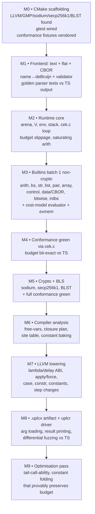

# llvm-uplc — Implementation Plan

A UPLC → LLVM AOT compiler that preserves CEK evaluation semantics bit-exactly (result, budget, and error class) and implements full Plutus V3 costing.

---

## 0. Locked decisions

| # | Decision | Choice |
|---|---|---|
| 1 | Semantic contract | Observable equivalence with TS reference: same normal-form term, bit-exact `{cpu, mem}` budget, preserved error class (success / `EvaluationFailure` / `OutOfBudget`). |
| 2 | Compilation strategy | **Option C — closure-converted lowering.** Each `LamAbs` becomes an LLVM function with uniform ABI; free variables flattened to captured-array closures. No CEK interpreter loop in generated code. |
| 3 | Host language split | **C++ compiler + C runtime.** Compiler uses native LLVM C++ API. Runtime `libuplcrt` is pure C for a trivial ABI from emitted IR. |
| 4 | Bigint + crypto | **GMP + libsodium + libsecp256k1 + BLST**, statically linked. |
| 5 | Memory management | **Per-evaluation bump arena**, 64 KB chunks, freed wholesale on termination. |
| 6 | Argument formats (`uplcr --arg`) | Text `.uplc`, binary `.flat`, and CBOR-wrapped flat (single or double). Auto-detect by extension; `--arg-text/--arg-flat/--arg-cbor` overrides. |
| 7 | Plutus version default | **v1.1.0** (enables `Constr`/`Case`). v1.0.0 still supported. |
| 8 | Budget default | **Unlimited.** `--budget cpu,mem` for protocol ceilings. Dedicated exit code on `OutOfBudget`. |
| 9 | Cost model | **Baked at compile time** as a `const` symbol inside the `.uplcx` artifact. Conway-era parameters ported from TS `cek/costs.ts`. |
| 10 | CLI output | Human text by default; `--json` flag for machine-readable. |

---

## 1. What the references tell us

### Term language

10 term forms: `Var`, `LamAbs`, `Apply`, `Force`, `Delay`, `Constant`, `Builtin`, `Error`, `Constr`, `Case`. Constants across 8 universes including recursive `data`. Programs wrapped `(program v.v.v …)`. Names → de Bruijn after parse.

### CEK machine

State alternates `compute(stack, env, term)` ↔ `return(stack, value)`.

Values:

- `VCon`
- `VDelay(term, ρ)`
- `VLam(term, ρ)`
- `VConstr(tag, fields)`
- `VBuiltin(fn, accum-args, remaining-signature)`

Environment is a cons-list indexed by de Bruijn level.

Frames: `FForce`, `FAppLeft(arg, ρ)`, `FAppRight(fn-value)`, `FConstr(…)`, `FCase(alts, ρ)`.

Builtins track remaining argument kinds (`ArgV` value / `ArgQ` force) so partial application interleaves with `Force`.

### Costing (TS is authoritative)

Two counters `{cpu, mem}` as `int64`.

Every CEK step charges a per-kind constant cost (9 step kinds — `Const`, `Var`, `Lambda`, `Apply`, `Delay`, `Force`, `Builtin`, `Constr`, `Case` — approximately 16000 cpu / 100 mem per step from current Conway parameters).

Each saturated builtin additionally charges a **cost model** that is a function of argument **sizes** (`ExMem`). Cost model shapes include: constant, linearInX, linearInY, added sizes, subtracted sizes, multiplied sizes, min size, max size, quadraticInX, quadraticInY, linearOnDiagonal, constAboveDiagonal, constBelowDiagonal, withInteraction — plus three- and six-argument variants.

TS loads a Conway-era JSON. Initial budget is usually the protocol limit or "unlimited" (for tests). Budget is spent via a saturating-arithmetic 200-step slippage buffer.

### Builtins

~101 builtins across 14 families: arith, bytestring, string, pair, list, array, data, control, crypto (ed25519 / ECDSA secp256k1 / Schnorr secp256k1 / SHA2-256 / SHA3-256 / Keccak-256 / Blake2b-224 / Blake2b-256), BLS12-381 (G1/G2/miller-loop/final-verify/hash-to-curve), bitwise, integer↔bytestring, `serialiseData`.

### Flat front-end

Bit-level reader; 4-bit term tags, 7-bit builtin tags, parallel type-then-value decoding for constants, `Data` via CBOR (restricted profile). De Bruijn already.

### Conformance

`plutus-conformance/test-cases/uplc/evaluation/**.uplc` — text UPLC in, expected text term + expected `{cpu, mem}` budget out. Errors encoded as `evaluation failure`. This is the oracle for the statement *"CEK semantics preserved"*.

---

## 2. Semantic contract (operational reading)

1. Given the same program + arguments, the compiled binary produces **the same normal-form term** the TS CEK machine produces (modulo alpha on free de Bruijn indices ≤ depth).
2. The **budget consumed is bit-exact** with the TS CEK machine (after slippage flush at termination).
3. **Error class is preserved:** `EvaluationFailure` (script failure) vs. `OutOfBudget` vs. successful return — never collapsed.
4. The conformance suite (100%) and a differential fuzzer vs. the TS reference are the acceptance tests.

This reading allows codegen freedom as long as the compiled code charges every CEK step the machine would charge.

---

## 3. CLI surface

```
uplcc  (compile)      uplcc  script.uplc   -o script.uplcx   [--flat]   [--cost-model conway.json]
uplcr  (run)          uplcr  script.uplcx  [--arg term.uplc]...  [--budget cpu,mem]  [--json]  [--interp]
```

- Two binaries, one shared runtime library (`libuplcrt.a`).
- `uplcr` prints the normal-form result term and a `Budget: cpu=… mem=…` line.
- Non-zero exit code for `EvaluationFailure` and `OutOfBudget`, distinct codes for each.
- Runtime-supplied `--arg` terms are parsed & normalised the same way as the program body, then `Apply`-wrapped onto the compiled term before evaluation.

---

## 4. Repository layout

```
/Users/sho/fun/llvm-uplc/
├── spec/                       (existing — formal spec)
├── CMakeLists.txt              root build, drives LLVM/GMP/sodium/secp256k1/BLST discovery
├── cmake/                      Find*.cmake shims
├── third_party/                git submodules: blst, libsecp256k1 (pinned)
├── include/uplc/               public headers shared between compiler & runtime
│   ├── term.h                  Term/Const/BuiltinTag enums, wire layout constants
│   ├── abi.h                   the C ABI between generated IR and libuplcrt
│   ├── budget.h                ExBudget + step-kind enum
│   ├── costmodel.h             cost-model struct layout (what uplcc bakes)
│   └── version.h               compiler/runtime version stamp + artifact magic
├── runtime/                    pure-C libuplcrt (see §6)
├── compiler/                   C++ uplcc (see §5)
├── driver/                     C++ uplcr (loads a .uplcx, calls libuplcrt)
├── tools/                      small helpers: cost-model codegen, builtin-table gen
├── tests/
│   ├── unit/                   per-module gtest unit tests
│   ├── conformance/            vendored IntersectMBO plutus-conformance fixtures
│   └── differential/           fuzzer harness vs /Users/sho/fun/uplc TS reference
└── docs/                       design notes (sparse — spec is the source of truth)
```

---

## 5. Compiler (`compiler/`)

```
compiler/
├── main.cc                      CLI parse, dispatch to Driver
├── driver.{cc,h}                orchestrates phases; owns LLVM context
├── frontend/
│   ├── lexer.{cc,h}             port of TS lexer.ts
│   ├── parser.{cc,h}            port of TS parse.ts
│   ├── flat_reader.{cc,h}       port of TS flat.ts (bit reader, term tags, builtin tags)
│   ├── cbor_unwrap.{cc,h}       single- and double-CBOR unwrap for on-chain scripts
│   ├── name_to_debruijn.{cc,h}  port of TS convert.ts
│   └── validate.{cc,h}          closedness, arity sanity, v1.0.0 rejects Constr/Case
├── ast/
│   ├── term.{cc,h}              post-frontend AST (de Bruijn, arena-allocated)
│   ├── program.{cc,h}           (version, term) + source metadata
│   ├── pretty.{cc,h}            for error messages; not the runtime pretty-printer
│   └── arena.{cc,h}             compile-time bump allocator (separate from runtime)
├── analysis/
│   ├── free_vars.{cc,h}         bottom-up free-variable sets, de Bruijn → capture-slot map
│   ├── scope_resolve.{cc,h}     for every Var, compute {kind: ARG|CAPTURE, slot}
│   ├── closure_plan.{cc,h}      for every LamAbs/Delay, the ordered capture list
│   └── site_table.{cc,h}        every CEK-countable node tagged with its step kind
├── costmodel/
│   ├── conway_params.{cc,h}     hard-coded Conway cost-model parameters (generated from TS costs.ts)
│   ├── bake.{cc,h}              emit UPLC_COST_MODEL as an LLVM const global
│   └── step_costs.{cc,h}        per-step-kind machine constants (matches runtime/budget)
├── codegen/
│   ├── llvm_types.{cc,h}        LLVM struct types: V, Env, Closure, Budget, Frame
│   ├── abi.{cc,h}               emit prototypes for runtime entry points (uplcrt_*)
│   ├── lower_term.{cc,h}        recursive term lowering → LLVM IR values
│   ├── lower_lambda.{cc,h}      emit one LLVM function per LamAbs with closure ABI
│   ├── lower_delay.{cc,h}       same for Delay (zero-arg thunk)
│   ├── lower_apply.{cc,h}       emit call to uplcrt_apply with budget charge
│   ├── lower_force.{cc,h}       emit call to uplcrt_force with budget charge
│   ├── lower_builtin.{cc,h}     emit VBuiltin construction (fn tag + empty accum)
│   ├── lower_constr.{cc,h}      allocate VConstr, store fields, charge BConstr
│   ├── lower_case.{cc,h}        evaluate scrutinee, dispatch via runtime helper
│   ├── lower_constant.{cc,h}    emit Const into .rodata (referenced by VCon payload)
│   ├── budget_charge.{cc,h}     inline step charge helper emission
│   └── module_emit.{cc,h}       LLVM module finalisation, verifier, object write
├── link/
│   ├── linker_driver.{cc,h}     invoke cc/lld to link against libuplcrt + libs
│   └── artifact.{cc,h}          .uplcx on-disk layout (see §8)
└── CMakeLists.txt
```

### Lowering conventions

- **Value `V`**: 16-byte struct `{ uint8_t tag; uint8_t pad[7]; uint64_t payload; }`. Passed by value in registers where LLVM can; otherwise by pointer.
- **Environment**: flat captured arrays instead of a cons-list. Each `LamAbs`/`Delay` has a `Closure { V (*fn)(V*, V, Budget*); uint32_t nfree; V free[nfree]; }` layout. The TS cons-list env only exists inside the runtime for builtin application remainders.
- **Uniform lambda ABI**: `V uplc_fn_<id>(V* env, V arg, Budget* b)`. Generated with `tailcc` or `fastcc` calling convention so `musttail` self- and cross-lambda calls are legal.
- **Uniform delay ABI**: `V uplc_dly_<id>(V* env, Budget* b)`.
- **Variable resolution**: compile-time. `Var 0` under a `LamAbs` → `arg`. `Var n` where it resolves to a captured free var → `env[slot]` via the `closure_plan` slot map. No runtime env walking in straight-line generated code.
- **Apply**: `tmp = uplcrt_apply(fn_v, arg_v, b)`. Runtime inspects tag: `VLam` → loads `closure->fn`, `musttail`s it with `closure->free`, `arg_v`, `b`; `VBuiltin` → accumulates, saturates via `uplcrt_run_builtin` if the new signature head is final; `VDelay/VCon/VConstr` → `EvaluationFailure`. User-side Apply is always followed by a step-cost bump for `BApply` **before** calling `uplcrt_apply`, matching TS.
- **Force**: mirror — `tmp = uplcrt_force(v, b)`. Runtime dispatches `VDelay` → call `closure->fn(free, b)`; `VBuiltin` → consume `ArgQ` and maybe saturate; else fail.
- **Case**: `uplcrt_case_dispatch(scrutinee, alt_table, n_alts, b)` returns a `V` that is the alt applied to the fields. Runtime does the per-field Apply loop to keep budget charges aligned with the TS model exactly.
- **Builtin**: `Builtin b` lowers to `uplcrt_make_builtin(TAG)`. No force count, no accum yet — the runtime's `VBuiltin` constructor stamps the initial signature from the tag.
- **Constant**: Integer, bytestring, string, bool, unit, data, list, pair. Scalars go in the `V.payload`. Heap payloads (bigint limbs, bytestring bytes, Data trees, list/pair elements) are baked as `const` symbols in `.rodata` by `lower_constant.cc`; `V` carries a tagged pointer into them. `uplcc` uses its own bump arena during AST construction; the output object's `.rodata` is populated from there.

### Step-cost emission

At every site in `site_table`, the codegen emits a single inlined bump (pseudo-C of the IR we emit):

```c
b->scratch[kind]++;
b->scratch[TOTAL]++;
if (b->scratch[TOTAL] >= SLIPPAGE) uplcrt_budget_flush(b);
```

TS's flush strategy is buffered per-step-kind and flushed every 200 steps total; we replicate that precisely so every `OutOfBudget` trip point matches. `SLIPPAGE`, the step-kind constants and their costs, and the flush function all live in `runtime/budget.c` — **single source of truth** shared with `uplcr`'s own direct evaluator.

### Costing for builtins

`uplcrt_run_builtin(tag, argv, b)` looks up the cost model row for `tag`, extracts argument sizes via `exmem_<tag>(argv)`, evaluates the cost-model expression with saturating i64, charges `b`, and dispatches the actual implementation. All of this lives in the runtime, not in generated IR — codegen only generates the saturation check (`is_signature_final`) and the call.

---

## 6. Runtime (`runtime/` — pure C, produces `libuplcrt.a`)

```
runtime/
├── include/                     (internal headers)
├── abi.c                        implementation of uplcrt_* ABI entry points
├── value.{c,h}                  V tagged-union helpers, constructors, inspectors
├── closure.{c,h}                Closure struct, allocator, free-var copy
├── env.{c,h}                    cons-list env (used only inside direct interpreter fallback)
├── stack.{c,h}                  frame stack (ditto)
├── cek.{c,h}                    direct CEK interpreter — used by uplcr for --interp mode + differential testing
├── apply.{c,h}                  uplcrt_apply implementation (see §5)
├── force.{c,h}                  uplcrt_force implementation
├── case.{c,h}                   uplcrt_case_dispatch (per-field Apply loop, charges steps)
├── builtin_table.{c,h}          generated: name, arity, force count, cost-model row, fn pointer
├── builtins/
│   ├── arith.c   bytestring.c   string.c    list.c    pair.c
│   ├── array.c   data.c         control.c   bitwise.c intbs.c
│   ├── crypto.c  bls.c          value.c
│   └── helpers.{c,h}            unwrap_bs, unwrap_int, make_bool, make_int, ...
├── data.{c,h}                   PlutusData ADT + equality
├── cbor.{c,h}                   restricted CBOR encoder/decoder for Data
├── bigint.{c,h}                 thin wrapper over GMP
├── budget.{c,h}                 ExBudget, slippage buffer, flush, sat_add/sat_mul
├── costmodel.{c,h}              algebra evaluator (port of costing.ts); reads baked struct
├── exmem.{c,h}                  computeArgSizes equivalent per builtin
├── arena.{c,h}                  bump allocator (64 KB chunks)
├── readback.{c,h}               V → Term for result printing
├── pretty.{c,h}                 Term → string (port of pretty.ts, golden parity)
├── term_blob.{c,h}              decode the .rodata term blob (used by uplcr fallback)
├── errors.{c,h}                 EvaluationFailure / MachineError / OutOfBudget carriers
└── CMakeLists.txt
```

**Key point:** every TS `cek/*` concept has a 1:1 file here. The C codebase is the ground-truth, and the compiler's lowered IR only calls into these functions — it never reimplements arithmetic or value manipulation inline.

The direct CEK interpreter in `cek.c` is not dead weight: `uplcr` will run with `--interp` for differential testing and for scripts `uplcc` hasn't compiled. M2–M5 bring this path up to green conformance **before** the compiler touches LLVM in M6.

---

## 7. Driver (`driver/uplcr.cc`)

Minimal C++: CLI, argument loading (text / flat / cbor auto-detect), budget ceiling, mode selection.

```
uplcr script.uplcx [--arg FILE]... [--budget cpu,mem] [--json] [--interp]
```

Flow:

1. `mmap` the `.uplcx`, locate `UPLC_HEADER` symbol via a well-known offset in our custom ELF / Mach-O note (see §8).
2. Parse each `--arg` (auto-detect: `.uplc` text / `.flat` flat / `.cbor` CBOR-wrapped). Each becomes a closed `V` via the runtime's term decoder.
3. Construct the program value by `uplcrt_apply`-chaining the script value onto each arg value.
4. In compiled mode, call the emitted `uplc_entry()` after seeding a `Budget` struct; this enters generated code. In `--interp` mode, hand the original term blob to `runtime/cek.c` instead.
5. On return, pretty-print result, flush budget, print `Budget: cpu=… mem=…`, exit with code.
6. On `EvaluationFailure`: exit 2, print `evaluation failure` + error message. On `OutOfBudget`: exit 3.

---

## 8. `.uplcx` artifact

A fully linked executable (Mach-O on macOS, ELF on Linux). Nothing exotic. Sections:

| Section | Contents |
|---|---|
| `.text` | generated lambda / delay / entry code, linked runtime code |
| `.rodata.uplc_term` | the original term blob (flat format + header) — for `--interp` and debugging |
| `.rodata.uplc_consts` | baked constants (bigint limbs, bytestrings, Data trees) |
| `.rodata.uplc_costmodel` | `UPLC_COST_MODEL` baked from `conway_params.cc` |
| `.rodata.uplc_header` | `UPLC_HEADER` magic + version + term-blob offset + cost-model offset + entry symbol |
| `.note.uplc` | 16-byte magic `"UPLCX\0\0\0…"` + compiler version for validation |

`uplcr` finds `UPLC_HEADER` by symbol name. The binary is directly executable (`./script.uplcx --arg foo.uplc`) because a compiled `main()` is also emitted — it just calls into `uplcr`'s driver code, which is also statically linked. So `uplcr` and `./script.uplcx` are interchangeable entry points onto the same runtime.

---

## 9. ABI between generated IR and libuplcrt (`include/uplc/abi.h`)

```c
typedef struct V       V;
typedef struct Budget  Budget;
typedef struct Closure Closure;

V         uplcrt_apply          (V fn, V arg, Budget* b);
V         uplcrt_force          (V thunk, Budget* b);
V         uplcrt_make_builtin   (uint8_t tag);
V         uplcrt_make_lam       (void* fn, const V* free, uint32_t nfree);
V         uplcrt_make_delay     (void* fn, const V* free, uint32_t nfree);
V         uplcrt_make_constr    (uint64_t tag, V* fields, uint32_t n);
V         uplcrt_case_dispatch  (V scrutinee, const V* alts, uint32_t n_alts, Budget* b);
void      uplcrt_budget_step    (Budget* b, uint8_t kind);  // inlined via header in Release
void      uplcrt_budget_flush   (Budget* b);
_Noreturn void uplcrt_fail      (Budget* b, int kind);      // EvaluationFailure / OutOfBudget
V         uplcrt_const_int_ref  (const void* limbs, int32_t sign, uint32_t nlimbs);
V         uplcrt_const_bs_ref   (const uint8_t* bytes, uint32_t len);
V         uplcrt_const_data_ref (const void* baked);
// ... one per constant family
```

Every entry marked `__attribute__((hot))` and, where safe, `nounwind`.

---

## 10. Compiler pipeline overview


---

## 11. Milestones



---

## 12. M0 work items

1. Create the top-level CMake project, `cmake/Find*.cmake` shims, vendor `third_party/blst` and `third_party/libsecp256k1` as submodules (pinned commits).
2. Write the `include/uplc/abi.h`, `budget.h`, `costmodel.h`, `term.h`, `version.h` headers so the shape of the C ABI is locked in early.
3. Stub `runtime/`, `compiler/`, `driver/` with empty libraries / binaries that build and link cleanly.
4. Vendor the conformance fixtures from IntersectMBO under `tests/conformance/fixtures/` (shallow clone at a pinned commit; git-ignored or submoduled — decision open).
5. Wire up a `ctest` that runs `uplcr --version` as a smoke test.

No evaluation logic, no codegen, no builtins in M0 — purely scaffolding so M1 onward has a green build to land on.

---

## 13. Open questions before M0

1. **Build system** — CMake default; Bazel / Meson / Make alternatives available.
2. **LLVM version** — pin target version (default suggestion: LLVM 18).
3. **Conformance fixtures** — submodule vs. shallow clone on first build.
4. **Platform** — macOS-only for v1, or Linux too from day one.
5. **Artifact extension** — `.uplcx` default; `.uplco` / `.uplcb` alternatives.
6. **Binary names** — `uplcc` (compile) + `uplcr` (run) default.
7. **Licence** — GMP is LGPL; does this matter for v1?
8. **Start M0 immediately, or wait?**
