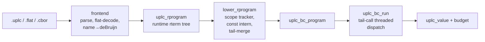
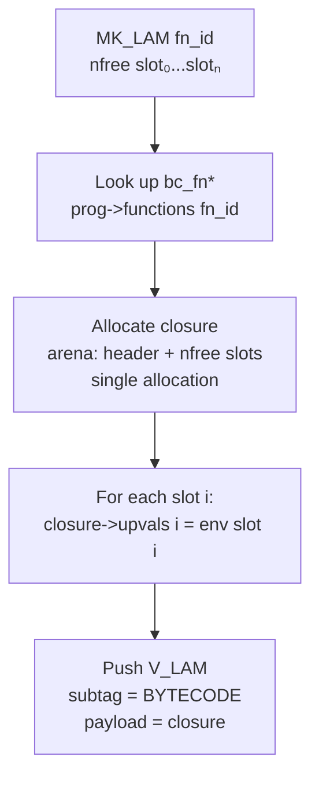
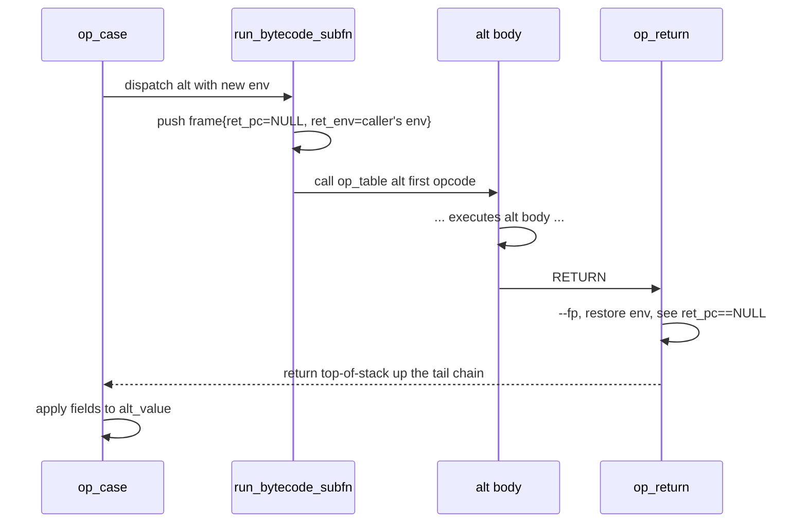
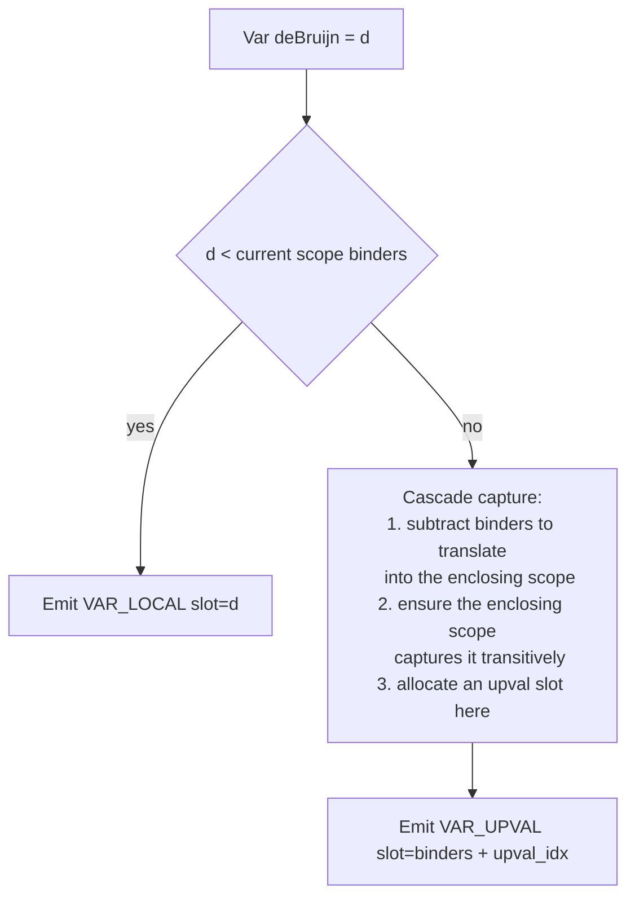
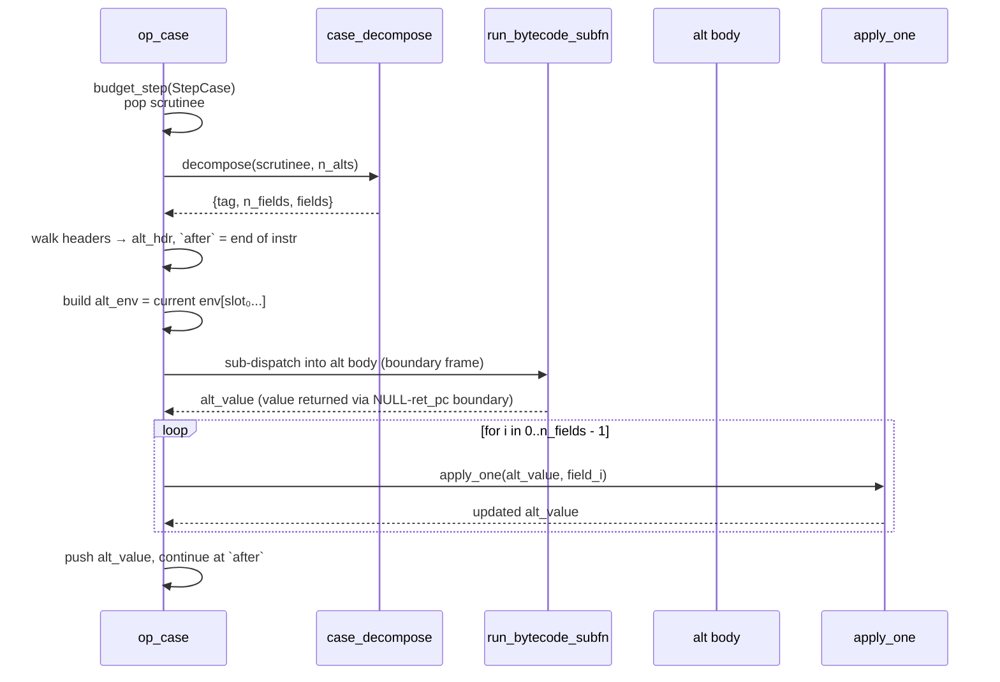

# UPLC Bytecode VM — Internal Reference

This document describes the bytecode representation, the dispatcher, the
call-frame and value-stack discipline, the constant pool, closures, the
lowerer's contract, and the invariants that keep `{cpu, mem}` bit-exact
against the TS CEK reference.

If you are modifying `runtime/bytecode/*`, `compiler_bc/lower_to_bc.cc`,
or `include/uplc/bytecode.h`, this is the source of truth. The code
lives up to what is written here; if the two disagree, the code is wrong.

Companion files:

- `include/uplc/bytecode.h` — public ISA header.
- `runtime/bytecode/dispatch.h` — dispatch macros, state struct, op table.
- `runtime/bytecode/vm.c` — `uplc_bc_run` entry.
- `runtime/bytecode/ops_*.c` — one TU per family of opcodes.
- `runtime/bytecode/closure.{c,h}` — bytecode closure layout.
- `runtime/bytecode/frames.h` — frame layout.
- `compiler_bc/lower_to_bc.cc` — rterm → bytecode lowerer.
- `compiler_bc/disasm.cc` — human-readable disassembler.

---

## 1. Overview



The bytecode VM is a **stack-based, register-biased dispatch loop**:

- **Value stack** — contiguous `uplc_value[]` (16 B each), the operand
  stack every opcode pushes/pops. Shared across all nested sub-dispatches.
- **Frame stack** — `uplc_bc_frame[]` (16 B each), records `{ret_pc, ret_env}`
  per call so returns go back correctly.
- **Environment** — flat `uplc_value[]` for the current function. Index 0 is
  the applied argument (for `LamAbs`); indices 1..n are upvals.
- **Constant pool** — program-level `uplc_value[]`, referenced by `CONST idx`.

Every opcode corresponds to exactly one CEK step in the TS reference
and charges one `uplcrt_budget_step(kind)` call. Builtin saturation
additionally pays the per-tag cost-model cost via `uplcrt_run_builtin`.

---

## 2. Quick reference card

| Op                | Imm24            | Tail words                                | Pops | Pushes | Step charge     |
|-------------------|------------------|-------------------------------------------|-----:|-------:|-----------------|
| `VAR_LOCAL`       | env slot         | —                                         |    0 |      1 | `StepVar`       |
| `VAR_UPVAL`       | env slot         | —                                         |    0 |      1 | `StepVar`       |
| `CONST`           | const-pool idx   | —                                         |    0 |      1 | `StepConst`     |
| `BUILTIN`         | builtin tag      | —                                         |    0 |      1 | `StepBuiltin`   |
| `MK_LAM`          | fn_id            | `nfree`, `slot[nfree]`                    |    0 |      1 | `StepLambda`    |
| `MK_DELAY`        | fn_id            | `nfree`, `slot[nfree]`                    |    0 |      1 | `StepDelay`     |
| `APPLY`           | —                | —                                         |    2 |      1 | `StepApply`     |
| `FORCE`           | —                | —                                         |    1 |      1 | `StepForce`     |
| `CONSTR`          | n_fields         | `tag_lo`, `tag_hi`                        |    n |      1 | `StepConstr`    |
| `CASE`            | n_alts           | `n_alts × {fn_id, nfree, slot[nfree]}`    |    1 |      1 | `StepCase` +    |
|                   |                  |                                           |      |        |   n_fields synthesized applies (unbudgeted per CEK) |
| `RETURN`          | —                | —                                         |   ≥1 |      — | (none)          |
| `ERROR`           | —                | —                                         |    — |      — | `StepConst`*    |
| `TAIL_APPLY`      | —                | —                                         |    2 |      — | `StepApply`     |
| `TAIL_FORCE`      | —                | —                                         |    1 |      — | `StepForce`     |

*ERROR's charge matches the TS reference which charges one step per
computed term regardless of outcome; `StepConst` is the placeholder bucket.

---

## 3. Instruction word format

Every opcode is a 32-bit word:

```
bit:  31                         8 7         0
     +-------------------------+-------------+
     |        imm24            |   opcode    |
     +-------------------------+-------------+
```

- **opcode** (8 bits): `uplc_bc_op` enum value (`0x01`..`0x0E` currently
  used; `0x00` and `0x0F`..`0xFF` are reserved).
- **imm24** (24 bits): opcode-specific immediate — env slot, pool index,
  fn id, n_fields, n_alts, etc. Unused when the opcode carries no
  immediate (`APPLY`, `FORCE`, `RETURN`, `ERROR`, `TAIL_APPLY`,
  `TAIL_FORCE`).

Helpers in `include/uplc/bytecode.h`:

```c
static inline uplc_bc_word uplc_bc_mk(uint8_t op, uint32_t imm24);
static inline uint8_t      uplc_bc_op_of   (uplc_bc_word w);
static inline uint32_t     uplc_bc_imm24_of(uplc_bc_word w);
```

Operands wider than 24 bits, or any variable-length tail (upval slots,
alt plans), live in follow-on 32-bit words after the opcode word.

### Why 32-bit opcodes and not packed bytecode?

- I-cache is not the bottleneck for validator-scale programs (most
  bytecode fits in tens of KB).
- Aligned 32-bit loads decode in one instruction; packed bytecode would
  need branch-heavy unaligned reads.
- Simpler disassembly, simpler emitter.
- Tail-words for variable-length ops are natural 32-bit operands.

---

## 4. Program & function layout

### `uplc_bc_program`

```c
typedef struct uplc_bc_program {
    const uplc_bc_fn*  functions;   // [0] is the top-level entry
    uint32_t           n_functions;
    const uplc_value*  consts;      // constant pool
    uint32_t           n_consts;
    uint32_t           version_major;
    uint32_t           version_minor;
    uint32_t           version_patch;
} uplc_bc_program;
```

The lowerer populates `functions[0]` as the **entry function** — the
top-level program body (the `(program …)` expression's term). Every
other function is a sub-function created by a `LamAbs`, `Delay`, or
`Case`-alt encountered during lowering.

Function ids are dense: `0, 1, 2, …, n_functions - 1`. References
(`MK_LAM fn_id`, `CASE …, fn_id, …`) are always valid indices.

### `uplc_bc_fn`

```c
typedef struct uplc_bc_fn {
    uint32_t            n_upvals;        // captured free-var count
    uint32_t            n_opcodes;       // total 32-bit words including operand tails
    const uplc_bc_word* opcodes;
    uint16_t            n_args;          // 1 for LamAbs, 0 for Delay and Case-alt
    uint16_t            max_stack;       // emit-time per-function hint (informational)
    const uplc_rterm*   body_rterm;      // original rterm for readback; NULL for Case-alt
    const uint32_t*     upval_outer_db;  // length n_upvals; each entry = outer deBruijn captured
} uplc_bc_fn;
```

- `n_args` is either 0 or 1. In UPLC every `LamAbs` is unary; Delays
  and Case alts don't take arguments.
- `max_stack` is a compile-time hint; the runtime ignores it and uses
  a generously-sized fixed value-stack (§8).
- `body_rterm` / `upval_outer_db` are used exclusively by
  `uplcrt_readback_bc_closure` when a `V_LAM`/`V_DELAY` with subtag
  `UPLC_VLAM_BYTECODE` escapes to the result (§14). Case-alt sub-functions
  leave them NULL because alt closures never escape `op_case`.

---

## 5. Constant pool

The pool is a program-level flat array of `uplc_value`. `CONST idx`
pushes `prog->consts[idx]` onto the value stack.

### Inline vs boxed

`uplc_value` is 16 bytes and carries one of:

- **Inline integer** — subtag bit `UPLC_VCON_INLINE_BIT` is set; the
  64-bit payload holds a sign-extended i64. No arena allocation.
- **Boxed constant** — payload is a pointer into an arena-owned
  `uplc_rconstant`. Valid for `integer` (when it doesn't fit i64),
  `bytestring`, `string`, `bool`, `unit`, `data`, `list`, `pair`,
  `array`, and the BLS / ledger-value universes.

The lowerer simply calls `uplc_make_rcon(rconstant)` on whatever the
frontend produced and appends the result to the pool. No dedup —
repeated literal occurrences get their own slots. This is cheap: the
pool is small and lookup is a pointer add.

### Pool lifetime

`prog->consts` points into memory owned by the `ProgramOwner`
(C++-side, RAII). The `uplc_rconstant` payloads live in the
`decode_arena` (see `BcPrep` in `tools/bench/main.cc` and `uplci`'s
`main`). Both outlive any `uplc_bc_run` invocation that references
them.

---

## 6. Closures

A bytecode closure is the payload of a `V_LAM` or `V_DELAY` value with
`subtag == UPLC_VLAM_BYTECODE`:

```c
typedef struct uplc_bc_closure {
    const struct uplc_bc_fn* fn;   // points into uplc_bc_program::functions
    uint32_t   n_upvals;
    uint32_t   _pad;
    uplc_value upvals[];           // flexible-array member, length n_upvals
} uplc_bc_closure;
```

### Allocation

Allocated in the evaluation arena by `op_mk_lam` / `op_mk_delay`:



The slot indices refer to the **current function's env** — i.e. the
emitter resolves them at compile time. `cutoff` = `n_args` of the
enclosing function: slots 0..n_args-1 refer to the enclosing fn's
argument(s), slots n_args..* refer to the enclosing fn's own upvals.

### Upval plan (capture plan)

`bc_fn->upval_outer_db[i]` holds the **outer deBruijn index** (0-based,
relative to the enclosing scope) that upval slot `i` of this function
corresponds to. Populated by the lowerer when a scope closes.

Readback uses `upval_outer_db` to reconstruct the original rterm body
under substitution (§14). The runtime itself doesn't consult it — the
runtime just reads `closure->upvals[i]` when `VAR_UPVAL` or `MK_LAM`
operand-slot addressing asks for it.

### Cross-mode safety

Subtag `UPLC_VLAM_BYTECODE` never unifies with `UPLC_VLAM_INTERP` or
`UPLC_VLAM_COMPILED`. Applying/forcing a VLam/VDelay with a mismatched
subtag raises `UPLC_FAIL_EVALUATION`. This keeps the three execution
modes isolated when values cross boundaries (e.g. `--arg` reduction in
`uplcr`).

---

## 7. Frame stack & return discipline

### Frame layout

```c
typedef struct uplc_bc_frame {
    const uplc_bc_word* ret_pc;   // opcode to resume at in the caller
    uplc_value*         ret_env;  // caller's environment
} uplc_bc_frame;
```

16 bytes per frame. The frame stack lives in the evaluation arena
(sized `UPLC_BC_DEFAULT_FRAMES = 32 K` entries = 512 KiB per eval by
default, freed wholesale on arena destroy).

### Push / pop invariants

- `APPLY`, `FORCE` into a bytecode closure: **push one frame** with
  `ret_pc = pc + 1`, `ret_env = current env`. Then switch env to
  `[arg, upvals...]` (or `[upvals...]` for Delay), dispatch into the
  callee's body.
- `RETURN` in a non-top-level function: **pop one frame**, restore
  env from the popped frame, dispatch to `ret_pc`. The return value
  sits at `sp - 1` and is preserved across the pop (the shared value
  stack means no copying).
- `RETURN` at the top level (`fp == frame_base`): flush budget
  slippage and return the top-of-stack value up the dispatch chain
  to the C caller (`uplc_bc_run`).

### Boundary frames (for `CASE`)

`op_case` runs alt bodies via a helper that pushes a **boundary
frame** with `ret_pc = NULL` before sub-dispatching. When the alt's
eventual `RETURN` sees `ret_pc == NULL`, it pops the frame but
**returns up the tail chain** instead of dispatching, so control
comes back to `op_case` so it can apply the constr's fields to the
alt value.



### Overflow

Frame overflow calls `uplcrt_bc_grow_frames(st)`, which currently
raises `UPLC_FAIL_MACHINE("frame stack overflow (depth > 32768)")`.
Arena-backed growth with realloc was prototyped but shelved due to a
longjmp/indeterminate-local interaction; see the comment in
`runtime/bytecode/vm.c` above `UPLC_BC_DEFAULT_FRAMES`.

---

## 8. Value stack & calling convention

### Shape

One contiguous `uplc_value[]` per `uplc_bc_run` call, sized
`UPLC_BC_DEFAULT_STACK = 16 K` entries = 256 KiB per eval. Freed with
the arena.

### Calling convention

Arguments are **pushed on the value stack in left-to-right order**;
opcodes pop them. `APPLY` expects the stack layout (top → bottom) to
be `arg, fn, …`:

```
   ↑ sp
   ┌────────────┐
   │    arg     │
   ├────────────┤
   │     fn     │
   ├────────────┤
   │   other    │
   └────────────┘
```

After `APPLY` with a bytecode VLam:

1. `arg` and `fn` are popped (sp -= 2).
2. A frame is pushed.
3. A new env `[arg, ...closure->upvals]` is allocated and installed.
4. Dispatch into `target->opcodes`.
5. When the callee RETURNs, its value sits at `sp - 1` in the shared
   stack (no extra copying).

So the caller sees net `sp → sp - 1` across a complete APPLY (popped 2,
gained 1 via callee's return).

### Invariant (emission contract)

`emit(term)` always produces code that **leaves exactly one value on
the stack** when it completes. The per-branch push/pop accounting in
`lower_to_bc.cc` tracks `stack_depth` and `max_stack` assuming this
invariant holds. Broken invariant ⇒ stack drift ⇒ VM clobbers the
next allocation.

### Why a fixed stack size

The value stack is **shared across all nested sub-dispatches**. The
per-function `max_stack` is a local high-water mark inside a single
function's body, but a callee's stack usage compounds on top of its
caller's current sp. Using a per-function `max_stack` at `uplc_bc_run`
time would systematically undersize the stack for real programs. A
generous fixed size is both simpler and correct; see comment above
`UPLC_BC_DEFAULT_STACK` in `vm.c`.

---

## 9. Environment model

### Layout

A function's environment is a flat `uplc_value[]`. For a `LamAbs`
(`n_args = 1`): `env[0] = applied arg`, `env[1..1+n_upvals] = upvals`.
For a `Delay` or `Case`-alt (`n_args = 0`): `env[0..n_upvals] = upvals`.

### Variable resolution

The lowerer resolves every `Var` reference at compile time. `Var`
carries a 1-based deBruijn index in the rterm; the lowerer converts
to 0-based and walks the scope stack:



### `VAR_LOCAL` vs `VAR_UPVAL`

At the **runtime** level, the two are equivalent — both read
`env[imm24]`. The distinction is for:

- Emitter diagnostics (you can see "this is an arg access" vs "this
  is a captured access" in the disassembly).
- A future inline-cache at call sites keyed by local-vs-upval.

### Cascading capture

When a deeply nested `Var` escapes multiple scopes, the lowerer
automatically adds captures at each intermediate scope so the inner
function can reach all the way up:

```
(lam a (lam b (lam c a)))
         ^^^^^^^^^^^^^^
         innermost references `a` = deBruijn 3 inside the inner lam.
```

The innermost scope captures (its upval_outer_db gains `a` relative
to its parent's frame); the parent scope also captures `a` relative
to its own grandparent; and so on until we reach the scope that
actually binds `a`. This happens in `resolve_var()` via recursive
invocation.

---

## 10. Per-opcode reference

Addresses below are within a function's `opcodes[]` word stream.
Every opcode begins with a 32-bit word carrying the opcode byte in the
low 8 bits and possibly an `imm24` in the high 24.

### `VAR_LOCAL` / `VAR_UPVAL`

```
  word 0: [op | slot:24]
```

Pushes `st->env[slot]` onto the value stack. Runtime identical for the
two opcodes; emit-time distinction is for inspection only.

Step charge: `StepVar`.

### `CONST`

```
  word 0: [CONST | const_pool_idx:24]
```

Pushes `prog->consts[idx]` onto the value stack. The value may be an
inline int or a boxed `uplc_rconstant` pointer.

Step charge: `StepConst`.

### `BUILTIN`

```
  word 0: [BUILTIN | builtin_tag:24]
```

Pushes a fresh `V_BUILTIN` with all forces and args unfilled. The state
machine in `runtime/core/builtin_state.c` drives subsequent `FORCE` /
`APPLY` accumulation until saturation.

Step charge: `StepBuiltin`.

### `MK_LAM` / `MK_DELAY`

```
  word 0: [MK_LAM   | fn_id:24]    (or MK_DELAY)
  word 1: nfree
  word 2..1+nfree: slot indices into the current env
```

Allocates a `uplc_bc_closure` in the arena and populates
`closure->upvals[i] = st->env[slot[i]]`. Pushes a `V_LAM` or `V_DELAY`
value with subtag `UPLC_VLAM_BYTECODE` and payload pointing at the
closure.

Step charge: `StepLambda` (for `MK_LAM`) or `StepDelay` (for `MK_DELAY`).

### `APPLY`

```
  word 0: [APPLY | _]
```

Pops `arg` and `fn`.

- `V_LAM` bytecode: push frame, switch env to `[arg, upvals...]`,
  dispatch into callee's body.
- `V_BUILTIN`: consume the arg via the state machine. On **saturation**
  (last arg, all forces done), the hot path skips `clone_state` and
  dispatches `uplcrt_run_builtin` directly on a stack-assembled args
  array. On non-saturation, `clone_state` builds a new VBuiltin value.
- `V_LAM` other subtag (INTERP/COMPILED): cross-mode, raises
  `UPLC_FAIL_EVALUATION`.
- Anything else: raises `UPLC_FAIL_EVALUATION("apply: not a function")`.

Step charge: `StepApply`. Saturated builtin additionally pays
cost-model cost via `uplcrt_run_builtin`.

### `FORCE`

```
  word 0: [FORCE | _]
```

Pops `v`.

- `V_DELAY` bytecode: push frame, switch env to `[upvals...]`,
  dispatch into the body.
- `V_BUILTIN`: consume a force. Saturating fast path parallels
  `APPLY`.
- Other: `UPLC_FAIL_EVALUATION`.

Step charge: `StepForce`.

### `CONSTR`

```
  word 0: [CONSTR | n_fields:24]
  word 1: tag_lo (low 32 bits of tag)
  word 2: tag_hi (high 32 bits of tag)
```

Pops `n_fields` values from the stack. Calls
`uplc_make_constr_vals(arena, tag, fields, n_fields)` which allocates a
`uplc_constr_payload` holding the tag and an arena-copied fields
array. Pushes a `V_CONSTR` value.

Step charge: `StepConstr`.

### `CASE`

```
  word 0: [CASE | n_alts:24]
  for each alt in tag order:
      word: fn_id
      word: nfree
      word × nfree: slot indices into the current env
```

Workflow:

1. Pop the scrutinee.
2. `uplcrt_case_decompose(budget, scrutinee, n_alts)` extracts a tag
   and field vector. Coerces constant-as-constructor types (bool,
   unit, pair, list, non-negative integer) per TS semantics.
3. Walk the per-alt headers to locate alt[tag] and compute the
   instruction's total length.
4. Build alt env: `env = [upvals]` where each upval comes from the
   current env at the stored slot index — Delay-shaped, no arg slot.
5. Sub-dispatch into the alt via `run_bytecode_subfn`, which pushes a
   boundary frame.
6. When the alt returns, apply fields to the returned value using a
   local `apply_one` helper which replicates APPLY semantics **but
   does NOT charge `StepApply`** — synthesized `FApplyTo` frames in
   the CEK reference are not backed by source-level `Apply` terms, so
   the cost model doesn't charge for them.

Step charge: `StepCase` (once).



### `RETURN`

```
  word 0: [RETURN | _]
```

- If `fp == frame_base`: top-level return. Flush budget slippage,
  return `*(sp - 1)` up the dispatch chain to `uplc_bc_run`.
- Else: pop one frame, restore `env` from it. If `ret_pc == NULL`
  (sub-dispatch boundary), return `*(sp - 1)` up the chain to the C
  caller that set up the boundary. Otherwise tail-call into
  `ret_pc`.

Never charges a step. The step is charged by the opcode that returned
a value (CEK computes term → charges → returns value; RETURN is
accounting, not computation).

### `ERROR`

```
  word 0: [ERROR | _]
```

Charges `StepConst` (matches TS's placeholder charge for the error
term) and raises `UPLC_FAIL_EVALUATION`. The dispatch chain unwinds
via `setjmp`/`longjmp` in `uplc_bc_run`.

### `TAIL_APPLY` / `TAIL_FORCE`

```
  word 0: [TAIL_APPLY | _]
```

Optimized forms of `APPLY + RETURN` (respectively `FORCE + RETURN`)
emitted when an apply or force appears in tail position in a function
body. The emitter rewrites the preceding `APPLY` / `FORCE` in-place
and skips emitting the following `RETURN`.

Runtime behavior:

- Bytecode VLam / VDelay: **skip the frame push**. The frame
  currently on top is the one pushed by whoever called us; when the
  callee's eventual `RETURN` pops it, control goes straight back to
  our caller, bypassing one frame push + pop.
- `V_BUILTIN`: consume the last arg / force via the saturating fast
  path, then inline the same logic `op_return` would execute
  (fp-check, pop frame, dispatch to ret_pc).

Budget parity: still charges one `StepApply` / `StepForce`. `RETURN`
was free, so nothing to compensate for.

Emission guard: the lowerer sets a `last_emitted_tail_eligible_` flag
**only** when `emit_op(APPLY)` or `emit_op(FORCE)` was the most recent
emission and **nothing has been written since**. Variable-length ops
(MK_LAM, MK_DELAY, CONSTR, CASE) end with data words — if we naively
looked at `opcodes.back()` we could mis-identify a data byte as an
opcode and clobber an operand. The explicit flag avoids that class of
bug.

---

## 11. Dispatch model

```c
typedef uplc_value (*uplc_bc_op_fn)(const uplc_bc_word* pc,
                                    uplc_value*         sp,
                                    uplc_bc_state*      st);

extern const uplc_bc_op_fn UPLC_BC_OP_TABLE[256];
```

Each opcode handler is a `static` function of this exact signature.
After doing its work and advancing `pc` / `sp`, a handler tail-calls
into the next opcode's handler:

```c
#define UPLC_BC_DISPATCH_NEXT(pc_, sp_, st_) do {                   \
    const uplc_bc_word _bc_w = (pc_)[0];                            \
    uint8_t _bc_op = (uint8_t)(_bc_w & 0xFFu);                      \
    UPLC_BC_MUSTTAIL                                                \
    return UPLC_BC_OP_TABLE[_bc_op]((pc_), (sp_), (st_));           \
} while (0)
```

`UPLC_BC_MUSTTAIL` expands to `[[clang::musttail]]`. LLVM lowers this
to a direct indirect jump (`jmp *[table + idx*8]`), identical to what a
computed-goto interpreter would emit. Per-handler indirect-branch
sites give the CPU branch predictor separate BP entries for each
opcode's "what comes next" distribution — much better accuracy than a
single switch's one BP entry.

### Dispatch state

```c
struct uplc_bc_state {
    uplc_value*             env;          // current function's env
    const uplc_bc_program*  prog;         // constant pool + function table
    uplc_budget*            budget;
    uplc_arena*             arena;
    void*                   fail_ctx;     // uplc_fail_ctx*, installed before dispatch
    uplc_value*             stack_base;   // value stack bounds (debug checks)
    uplc_value*             stack_end;
    uplc_bc_frame*          fp;           // frame stack pointer (next free)
    uplc_bc_frame*          frame_base;   // start of frame stack
    uplc_bc_frame*          frame_end;    // one past last frame slot
};
```

All of this lives on the C stack inside `uplc_bc_run`. Its address is
passed through the tail chain as `st`. Clang keeps `pc`, `sp`, `st` in
callee-saved registers across `musttail` calls.

### Failure path

`uplc_bc_run` installs a `uplc_fail_ctx` via `setjmp` + `uplcrt_fail_install`.
Any `uplcrt_raise(kind, msg)` longjmps back to the `setjmp` site, where
`uplc_bc_run` builds a failure `uplc_bc_result`. The per-iter arena is
destroyed by the caller.

---

## 12. Budget model

### Per-step charging

Every opcode calls `uplcrt_budget_step(budget, kind)` at the top of
the handler. This is a `static inline` function in `uplc/budget.h`:

```c
static inline void uplcrt_budget_step(uplc_budget* b, uplc_step_kind kind) {
    unsigned k = (unsigned)kind;
    ++b->scratch[k];
    if (++b->scratch[UPLC_STEP__COUNT] >= UPLC_SLIPPAGE) {
        uplcrt_budget_flush(b);   // out-of-line cold path
    }
}
```

`UPLC_SLIPPAGE = 200` matches the TS reference's slippage buffer — 
OOB checking is deferred to the terminal `uplcrt_budget_flush` so hot
paths see a single compare+branch per step.

### Builtin cost

`uplcrt_run_builtin` additionally computes per-arg sizes via
`uplcrt_builtin_arg_sizes` and evaluates the cost-model polynomial via
`uplcrt_costfn_eval`. Result is subtracted from `budget->cpu` /
`budget->mem` using saturating arithmetic.

### Bit-exact parity

The step-kind enum, the slippage buffer size, the per-kind base costs
(read from a baked Conway-era table in `runtime/core/builtin_table.c`),
the cost-shape algebra, and the saturating arithmetic are **shared
verbatim** with the CEK path. Any semantic change to any of these
touches both paths simultaneously — which is why the bytecode
conformance test produces exactly the same 720 budget-ok / 8
budget-mismatch counts as the CEK conformance test.

---

## 13. Emission pipeline

```mermaid
graph LR
    AST[uplc::Program<br/>deBruijn AST] --> LTR[lower_to_runtime<br/>existing frontend]
    LTR --> RT[uplc_rprogram]
    RT --> LBC[Lowerer::run]
    subgraph Lowerer
    LBC --> SCOPE[Scope stack<br/>binders + captures + opcodes]
    LBC --> INTERN[Constant intern]
    LBC --> WALK[Recursive emit]
    WALK --> CAPS[resolve_var<br/>cascading capture]
    WALK --> TAIL[emit_return<br/>tail-merge APPLY/FORCE]
    end
    LBC --> OWN[ProgramOwner<br/>RAII heap-backed<br/>bc_fn[] + consts[]]
    OWN --> PROG[uplc_bc_program]
```

### Scope tracker

Each scope (LamAbs, Delay, Case-alt, top-level) gets a `Scope` record
during lowering:

```cpp
struct Scope {
    uint32_t binders;                                  // 1 for Lam, 0 for Delay/Case-alt
    std::unordered_map<uint32_t, uint32_t> db_to_upval;
    std::vector<uint32_t> upval_outer_db;
    std::vector<uplc_bc_word> opcodes;
    uint32_t fn_id;
    const uplc_rterm* body_rterm;
    uint32_t stack_depth;
    uint32_t max_stack;
};
```

- `db_to_upval` maps "deBruijn index relative to the enclosing scope"
  (i.e. `d - binders` for a `Var(d)` that escaped) to "our upval slot".
- `upval_outer_db` is the inverse: slot-ordered list of outer deBruijn
  indices. Persisted on the resulting `bc_fn` for readback.
- `stack_depth` / `max_stack` track the per-emit-step value stack
  high-water mark (informational; the runtime uses a fixed-size stack).

### `resolve_var` (cascading capture)

When `Var(d)` is emitted inside scope `S[top]`:

```
if d < S[top].binders:
    return d                       // local: VAR_LOCAL d
else:
    let k = d - S[top].binders     // deBruijn relative to parent
    if S[top] already captured k:
        return binders + S[top].db_to_upval[k]
    ensure S[top - 1] can resolve k   // recursive: parent might itself need to capture
    allocate new upval slot in S[top]:
        idx = S[top].upval_outer_db.size()
        S[top].db_to_upval[k] = idx
        S[top].upval_outer_db.push_back(k)
    return binders + idx
```

Cascading up the stack ensures an inner capture at depth `N` causes
every intermediate scope to also capture the same binder, so the chain
of `MK_LAM` operands eventually reaches a local binder.

### `emit_return` and the tail-merge guard

```cpp
bool last_emitted_tail_eligible_ = false;

void emit_op(uint8_t op, uint32_t imm24) {
    opcodes.push_back(uplc_bc_mk(op, imm24));
    last_emitted_tail_eligible_ =
        (op == UPLC_BC_APPLY) || (op == UPLC_BC_FORCE);
}

void emit_word(uplc_bc_word w) {
    opcodes.push_back(w);
    last_emitted_tail_eligible_ = false;  // data word, never an opcode
}

void emit_return() {
    if (tail_optimize_next_return_ && last_emitted_tail_eligible_) {
        // Rewrite the previous APPLY/FORCE → TAIL_APPLY/TAIL_FORCE
        // and skip emitting RETURN.
        ...
    } else {
        emit_op(UPLC_BC_RETURN, 0);
    }
}
```

Key invariant: `last_emitted_tail_eligible_` is **only** set by
`emit_op(APPLY|FORCE)` and cleared by any subsequent `emit_word` or
`emit_op` of a different opcode. This prevents the old bug where a
slot-index data word whose low byte happened to be `0x08` was
mis-identified as a `FORCE` opcode and rewritten to `TAIL_FORCE`.

### Tail-merge suppression for Case alts

Case alt sub-function bodies run under a sub-dispatch boundary
(`ret_pc == NULL` frame). Tail-eliminating the alt's final `RETURN`
would cause the callee's `RETURN` to skip the boundary check and
dispatch to whatever is under the boundary on the frame stack — not
`op_case`. So the lowerer saves and flips `tail_optimize_next_return_`
to `false` around each alt emission.

Inner Lambda / Delay bodies emitted **inside** an alt body are
unaffected: they have their own `emit_return` calls from their own
scope contexts; they're closed via regular `APPLY`+`RETURN` and can
safely tail-merge.

### Push/pop accounting

Every emission site calls `push_stack(n)` / `pop_stack(n)` so
`max_stack` reflects the function's own high-water mark:

| Term       | Push  | Pop   | Net after emit |
|------------|-------|-------|---------------:|
| Var        | 1     | 0     |     +1         |
| Lambda     | 1     | 0     |     +1         |
| Delay      | 1     | 0     |     +1         |
| Apply      | 1+1+_ | 2     |     +1         |
| Force      | +_    | 0     |     +0         |
| Constant   | 1     | 0     |     +1         |
| Builtin    | 1     | 0     |     +1         |
| Error      | 1     | 0     |     +1 (never executes past) |
| Constr n   | n     | n     |     +1         |
| Case       | 1+_   | 1     |     +1         |

The `+1` net-after-emit invariant is what `run_bytecode_subfn` /
`op_return` rely on: at the callee's `RETURN`, exactly one value is on
the stack (the return value).

---

## 14. Readback & value reconstruction

When `uplc_bc_run` returns a value to the CLI / test harness, that
value is pretty-printed by walking it back to an rterm via
`uplcrt_readback`. For `V_LAM` / `V_DELAY` with subtag
`UPLC_VLAM_BYTECODE`, the function can't just print the opcodes — it
has to reconstruct the original term under substitution of captured
values.

`runtime/cek/readback.c` handles this via `uplcrt_readback_bc_closure`:

```
readback(V_LAM [bytecode]) =
    uplc_rterm_lambda(
        arena,
        substitute(
            arena,
            closure->fn->body_rterm,
            env_arr,            // dense array built from sparse upvals
            env_len,
            initial_depth = 1   // 0 for V_DELAY
        )
    )
```

The **dense-env construction** is the tricky part: the bytecode closure
has a sparse map `slot → value` but `substitute` (shared with the CEK
path) walks the rterm body and does `env_arr[outer_db]`. Readback
builds a dense array covering `0..max(upval_outer_db)`, fills the
indexed slots with `closure->upvals[slot]`, and leaves unreferenced
slots as a placeholder (never read for a well-formed program — the
body only references captured deBruijns).

Case-alt closures never escape — `op_case`'s sub-dispatch consumes
them synchronously — so their `bc_fn` has `body_rterm = NULL` and
readback would produce a sentinel if it ever got one. In practice it
doesn't.

---

## 15. Correctness invariants

Anything modifying the VM or the lowerer MUST preserve these.

**Semantic parity:**

1. **Result term**: same normal-form rterm as the TS CEK reference
   (modulo alpha on free deBruijn indices ≤ depth).
2. **Budget**: `{cpu, mem}` bit-exact with the TS CEK after the final
   slippage flush.
3. **Error class**: `EvaluationFailure` / `OutOfBudget` /
   success — never collapsed.

**Structural:**

4. Every `emit(term)` leaves net +1 on the value stack. The per-branch
   `push_stack` / `pop_stack` bookkeeping encodes this.
5. Every function body ends with exactly one of: `RETURN`,
   `TAIL_APPLY`, `TAIL_FORCE`, or `ERROR`. No fall-through.
6. `max_stack` on `bc_fn` is a local per-function high-water mark;
   it's informational. The runtime's actual stack sizing is the fixed
   `UPLC_BC_DEFAULT_STACK` because sub-dispatch shares the stack.
7. `upval_outer_db` on `bc_fn` is ordered: slot 0 corresponds to the
   outermost capture ordering the lowerer discovered first. Readback
   depends on this.
8. Subtag `UPLC_VLAM_BYTECODE` closures are only created by the
   bytecode VM's `MK_LAM` / `MK_DELAY`. Attempting to apply/force one
   from INTERP or COMPILED code raises EvaluationFailure.

**Tail-call:**

9. `TAIL_APPLY` / `TAIL_FORCE` are emitted only when the preceding
   `APPLY` / `FORCE` was the most recent emission AND nothing has
   been emitted since. The `last_emitted_tail_eligible_` flag in the
   lowerer enforces this; `emit_word` clears it unconditionally.
10. Case alt bodies do NOT tail-merge their final return — the sub-
    dispatch boundary (`ret_pc = NULL`) must be observed by
    `op_return`, otherwise control escapes `op_case` prematurely.

**Dispatch:**

11. Every opcode handler advances `pc` by the correct operand count
    (1 for leaf ops; 3 for `MK_LAM`/`MK_DELAY` at minimum + nfree
    slots; 3 for `CONSTR`; variable for `CASE`).
12. `UPLC_BC_OP_TABLE` has a non-null entry for every opcode value
    the emitter may produce. Dispatching through a NULL slot jumps to
    address 0 and crashes.
13. The handler signature (`const uplc_bc_word*, uplc_value*,
    uplc_bc_state*` → `uplc_value`) is identical for every handler,
    so `[[clang::musttail]]` is valid at every dispatch site.

---

## 16. Performance notes

### Current single-script speedup over tree-walking CEK

Measured 2026-04-16 on M-series Apple silicon, pure VM time (arena
allocation + dispatch; excludes flat decode, rterm lowering, bytecode
lowering — all pre-computed):

| script            | bc µs  | cek µs | bc/cek |
|-------------------|-------:|-------:|-------:|
| auction_1-1       |  54.1  |  89.5  | 1.65×  |
| auction_2-3       | 268.4  | 420.8  | 1.57×  |
| coop-3            | 703.6  | 975.7  | 1.39×  |
| multisig-sm-01    | 121.6  | 219.3  | 1.80×  |
| uniswap-1         | 127.3  | 210.5  | 1.65×  |
| uniswap-3         | 510.7  | 890.4  | 1.74×  |

Geomean ≈ **1.63×**.

### Optimizations that contributed

1. **Tail-call-threaded dispatch** via `[[clang::musttail]]`. Gives
   LuaJIT-computed-goto-class branch prediction with per-op register
   allocation.
2. **Inline `uplcrt_budget_step`** in `uplc/budget.h`. Every op pays
   one step; an out-of-line call would have been 20-30% of the budget
   on hot ops.
3. **Inline `uplc_arena_alloc` fast path** in `runtime/core/arena.h`.
   Bump-and-check without a function call per env / closure / constr
   allocation.
4. **Closure in-place build** in `MK_LAM` / `MK_DELAY`. Skip the
   intermediate upvals buffer, write captures directly into the
   flexible-array upvals[] of the closure at allocation time.
5. **`__builtin_expect` hints** on the VLam/VDelay bytecode fast path
   of APPLY/FORCE so the VBuiltin and cross-mode branches stay cold.
6. **Struct-init** for `uplc_value` construction instead of per-byte
   zeroing of the `_pad[]` — the compiler emits a single 16 B store.
7. **Tail-call opcodes** (`TAIL_APPLY`, `TAIL_FORCE`). Saves one
   frame push + pop per call when the apply/force is the last opcode
   of a function.
8. **Builtin saturation fast path**. Saturating `APPLY` / `FORCE` on
   a `V_BUILTIN` skips `clone_state`'s arena alloc (state + args
   array) and assembles args on the C stack before calling
   `uplcrt_run_builtin` directly.

### Known remaining gaps

- **Inline hot builtins by body.** `addInteger`, `equalsInteger`,
  `ifThenElse`, `unIData`, `headList`, `tailList`, `fstPair`,
  `sndPair`, `chooseData` account for a large fraction of hot-path
  time in real scripts. Currently every one dispatches through the
  `uplcrt_run_builtin` → `UPLC_BUILTIN_META[tag].impl` function
  pointer. Writing inline fast paths (with inline-int operands
  specifically) would probably net another 10-20% on arithmetic-
  heavy scripts. Ruled out so far because keeping inlined
  implementations in sync with the authoritative `runtime/builtins/`
  versions has non-trivial maintenance cost.
- **Inline cache at `APPLY` sites.** Validators tend to be
  monomorphic at a given call site — caching `{last_fn, last_target}`
  per site would skip the closure-of + tag-check sequence on hits.
  Not implemented; needs an emit-time instruction slot or a side
  table.
- **NaN-boxing `uplc_value`** (16 B → 8 B) was considered. Builtins
  dominate the hot path and all assume the 16 B layout, so the
  marshalling tax likely eats the register-pressure win. Deferred.
- **Fused flat → bytecode decoder.** Current path is
  flat → AST → rterm → bytecode. A single-pass fused decoder that
  emits opcodes directly from the bit reader (with scope-tracker
  bookkeeping) was in the original plan. Deferred to a later perf
  pass; not needed for within-VM timing but matters for cold-start
  benchmarks like SAIB that include decode.

---

## 17. Limitations

- **Frame stack ceiling** 32 K entries. Programs recursing deeper than
  that fail with `UPLC_FAIL_MACHINE("frame stack overflow")`. The
  `gun-*.flat` / `useCasing1.flat` / `useOld1.flat` fixtures in the
  SAIB benchmark corpus hit this.
- **AST-build stack overflow** in the **shared** `lower_to_runtime`
  (C++ recursive walker) on extreme-depth fixtures — `fixCase.flat`,
  `fixCaseDataConstr.flat`, `gun-3000.flat`. Not a bytecode-VM bug;
  affects the CEK path equally. Would require an iterative lowering
  pass to fix.
- **No persistent `.uplcbc` format.** `uplci --dump` emits
  human-readable disassembly. Serializing + reloading a compiled
  program would need an encoder for every `uplc_rconstant` universe
  (bigint, Data, BLS, ledger-value, lists, pairs, arrays) plus a
  loader; scoped out for now.

---

## 18. Where to look next

- Changing an opcode's semantics: edit `runtime/bytecode/ops_*.c` and
  re-run `ctest --test-dir build` + `build/tests/bc_conformance_test`.
- Adding an opcode: bump `uplc_bc_op` in `include/uplc/bytecode.h`,
  add a handler `uplc_bc_op_*` + declaration in `dispatch.h`, wire
  into `UPLC_BC_OP_TABLE` in `vm.c`, teach `disasm.cc` to decode its
  operands.
- Changing the lowerer: `compiler_bc/lower_to_bc.cc`. After any
  change, verify via `build/tests/bc_lower_test` (parity vs CEK) and
  `build/tests/bc_conformance_test` (full IntersectMBO suite).
- Changing budget semantics: touch `runtime/core/builtin_dispatch.c`
  or `runtime/core/costmodel.c` — and know that you're also changing
  the CEK path and the JIT path because the cost model is shared.
